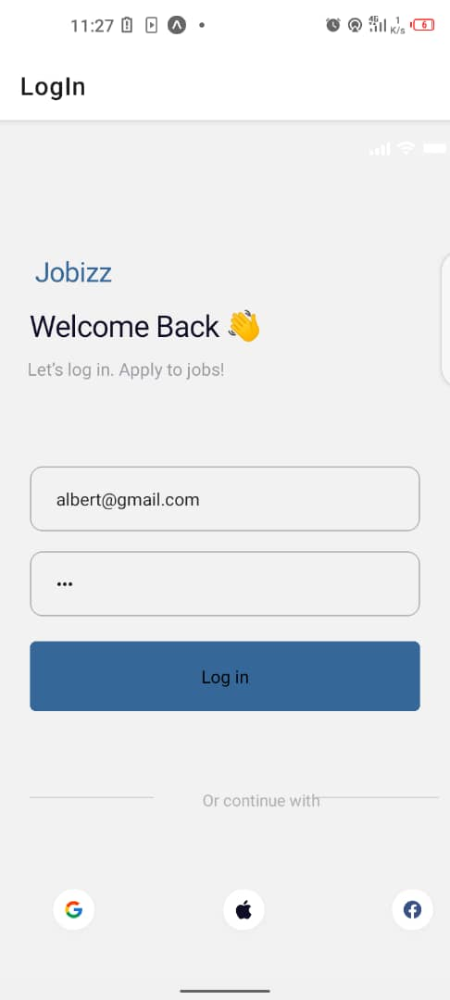

# rn-assignment4-11330761
markdown
Copy code
# Job Search App

This project is a mobile application built with React Native for job seekers to explore featured and popular job listings. It provides a user-friendly interface to search for jobs by various criteria and view details about each job.

## Features

- **Featured Jobs**: Display a list of featured job opportunities.
- **Popular Jobs**: Show popular job listings based on user interest.
- **Search Jobs**: Ability to search for specific jobs or positions.
- **Job Details**: View detailed information about each job listing.
- **User Profile**: Access and manage user account information.

## Screenshots

*Figure 1: Homepage displaying featured and popular jobs.*

*Figure 2: login details page showing specific login information.*

## Installation

To run this project locally, follow these steps:

1. Clone the repository:

git clone https://github.com/yourusername/job-search-app.git

csharp
Copy code

2. Navigate into the project directory:

cd job-search-app

markdown
Copy code

3. Install dependencies:

npm install

markdown
Copy code

4. Start the Metro bundler:

npm start

markdown
Copy code

5. Use Expo client to run the application on a simulator or a physical device.

## Technologies Used

- **React Native**: Frontend framework for building mobile applications.
- **Expo**: Development platform for building and deploying React Native projects.
- **JavaScript (ES6+)**: Programming language used for application logic.
- **CSS-in-JS (with StyleSheet)**: Styling solution for React Native components.

## Contributing

Contributions are welcome! Here's how you can contribute to the project:

1. Fork the repository.
2. Create a new branch (`git checkout -b feature/new-feature`).
3. Make your changes.
4. Commit your changes (`git commit -am 'Add new feature'`).
5. Push to the branch (`git push origin feature/new-feature`).
6. Create a new Pull Request.

## License

This project is licensed under the MIT License. See the [LICENSE](./LICENSE)